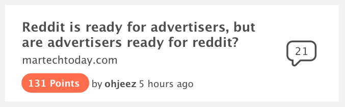

## Assignment

The purpose of this is to get a small sample of some of your work, and have something
concrete to discuss next time we see you.

We respect and appreciate your time: please do not spend more than a couple hours on
this. Feel free to turn in what you have at the end of that time, and provide a brief explanation of
what you would do next, given more time.

## Installation

Both the CLI and generated project have dependencies that require Node 8.9 or higher, together with NPM 5.5.1 or higher.

```BASH
git clone https://github.com/LiveSafe/lvsf-frontend-assignment.git

cd lvsf-frontend-assignment

npm install
```

## Task

#### Part 1: Create news item layout

The design for each news item is below, try to match the design as closely as possible.

NOTE: The comments icons is included under src/assets.
NOTE2: the gray section is the background not a card border



#### Part 2: Implement search

Implement search that narrows the list as you type.

Your search should check for a partial match on the "title", "url", and "user" fields

Write a unit test to verify that the search works correctly

## Development server

Run `npm start` for a dev server. Navigate to `http://localhost:4200/`. The app will automatically
reload if you change any of the source files.

## Build

Run `npm run build` to build the project. The build artifacts will be stored in the `dist/`
directory.

## Running unit tests

Run `npm test` to execute the unit tests via [Karma](https://karma-runner.github.io).
